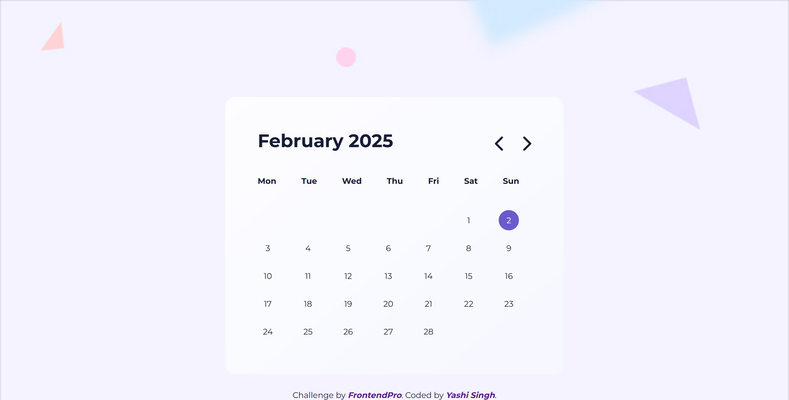

# Calendar Viewer Component

This is a solution to the [Calendar Viewer Component Challenge](https://www.frontendpro.dev/frontend-coding-challenges/calendar-viewer-component-KnvtY1kLkwCisNB2LTsG) on FrontendPro. The challenge involves creating a dynamic calendar component where users can navigate between months and view the current date highlighted.

## Table of Contents

- [Overview](#overview)
  - [The Challenge](#the-challenge)
  - [Screenshot](#screenshot)
  - [Links](#links)
- [Installation and Setup](#installation-and-setup)
  - [Installing LESS Preprocessor](#installing-less-preprocessor)
  - [Running the LESS Compiler](#running-the-less-compiler)
- [Built With](#built-with)
- [Features](#features)
- [Author](#author)
- [Acknowledgments](#acknowledgments)

## Overview

### The Challenge

Users should be able to:
- View a calendar displaying the current month
- Navigate between months using previous and next buttons
- See the current day highlighted

### Screenshot



### Links

- [Solution URL](https://www.frontendpro.dev/frontend-coding-challenges/calendar-viewer-component-KnvtY1kLkwCisNB2LTsG/solutions/q99jkAaqMkXhPnhMGlFM)
- [Live Site URL](https://yashi-singh-9.github.io/Calendar-Viewer-Component/)

## Installation and Setup

To run this project locally, follow these steps:

### Installing LESS Preprocessor

This project uses LESS as a CSS preprocessor. To install it, you need Node.js and npm installed on your system.

1. Install [Node.js](https://nodejs.org/) if you haven't already.
2. Open a terminal and run the following command to install LESS globally:
   ```sh
   npm install -g less
   ```

### Running the LESS Compiler

To compile the LESS file into CSS, run:

```sh
lessc assets/style.less assets/style.css
```

You can also set up a watcher to automatically compile LESS when changes are made:

```sh
less-watch-compiler assets assets
```

## Built With

- Semantic HTML5
- LESS (CSS Preprocessor)
- JavaScript (Vanilla JS)
- Font Awesome Icons

## Features

- Dynamic calendar rendering based on the current date
- Previous and next month navigation
- Current day highlighting
- Responsive design

## Author

- LinkedIn - [Yashi Singh](https://www.linkedin.com/in/yashi-singh-b4143a246)
- FrontendPro - [FrontendPro Challenges](https://www.frontendpro.dev/frontend-coding-challenges)

## Acknowledgments

Thanks to [FrontendPro](https://www.frontendpro.dev/) for providing this challenge and an opportunity to enhance frontend development skills.
